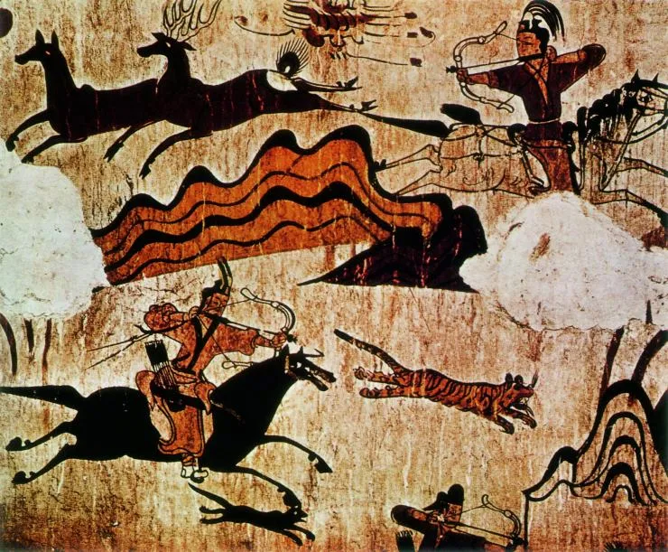
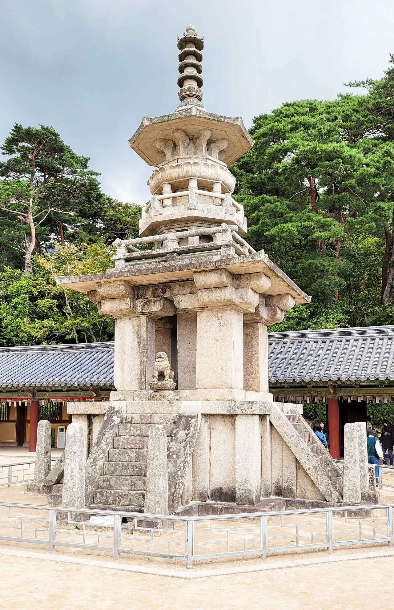
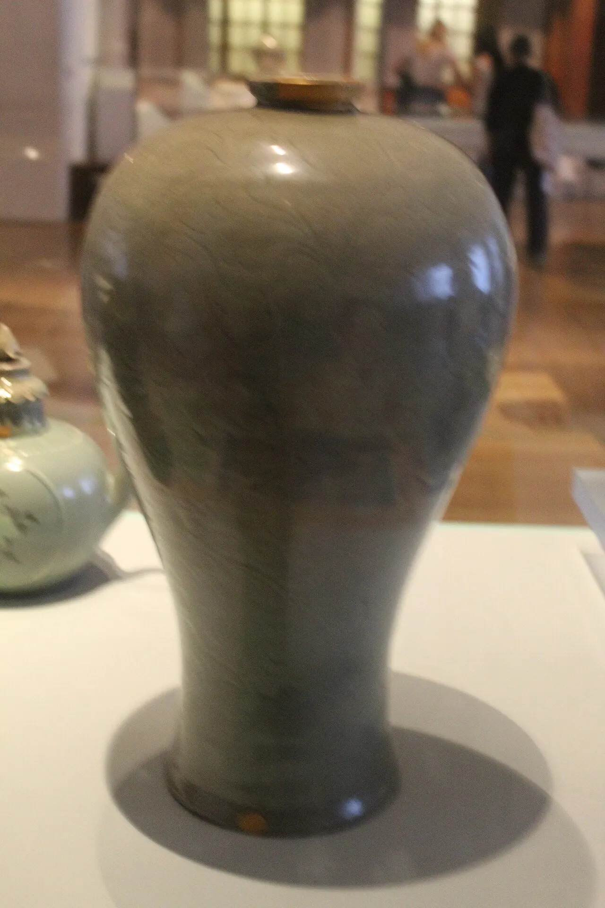
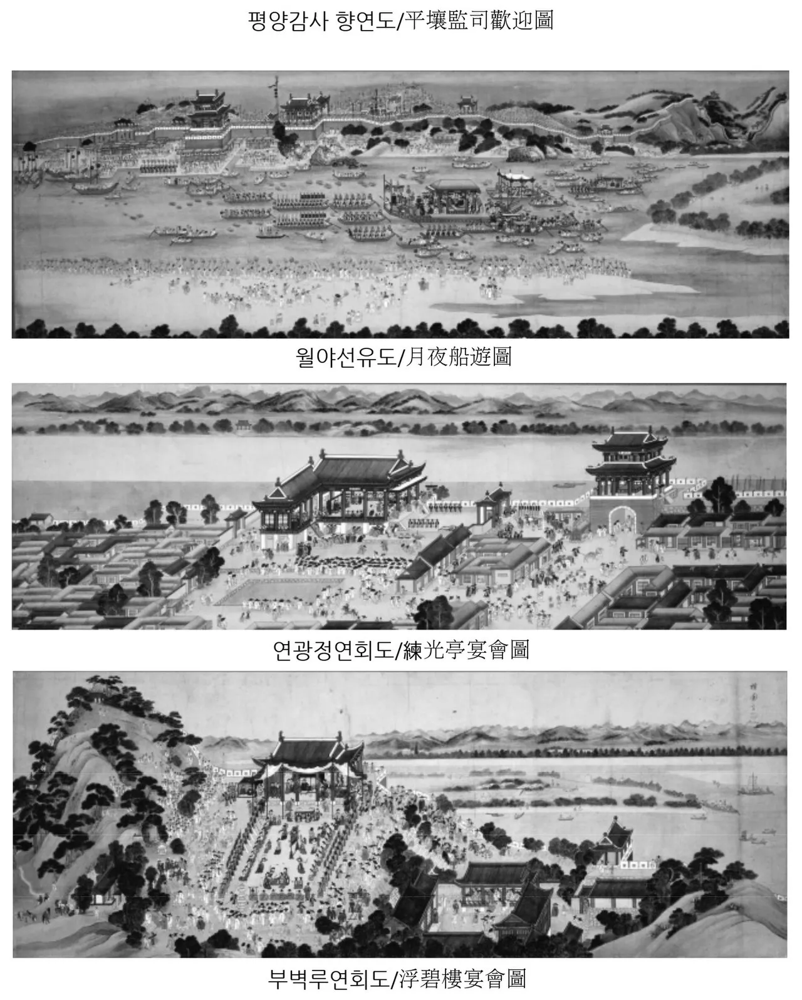
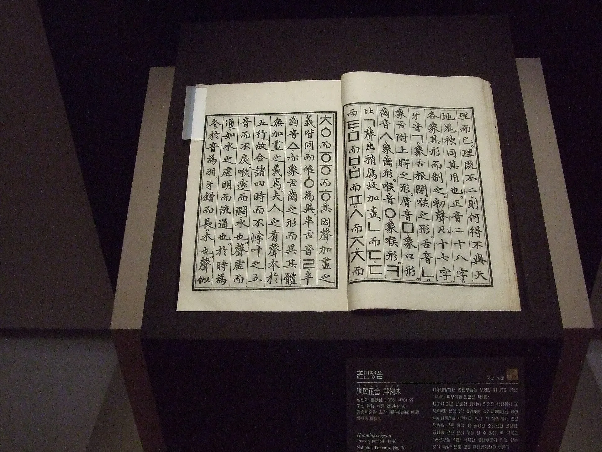
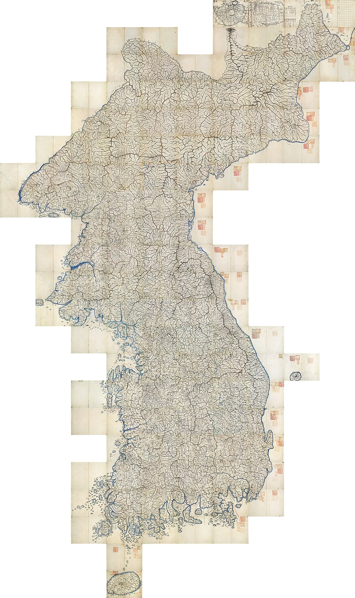
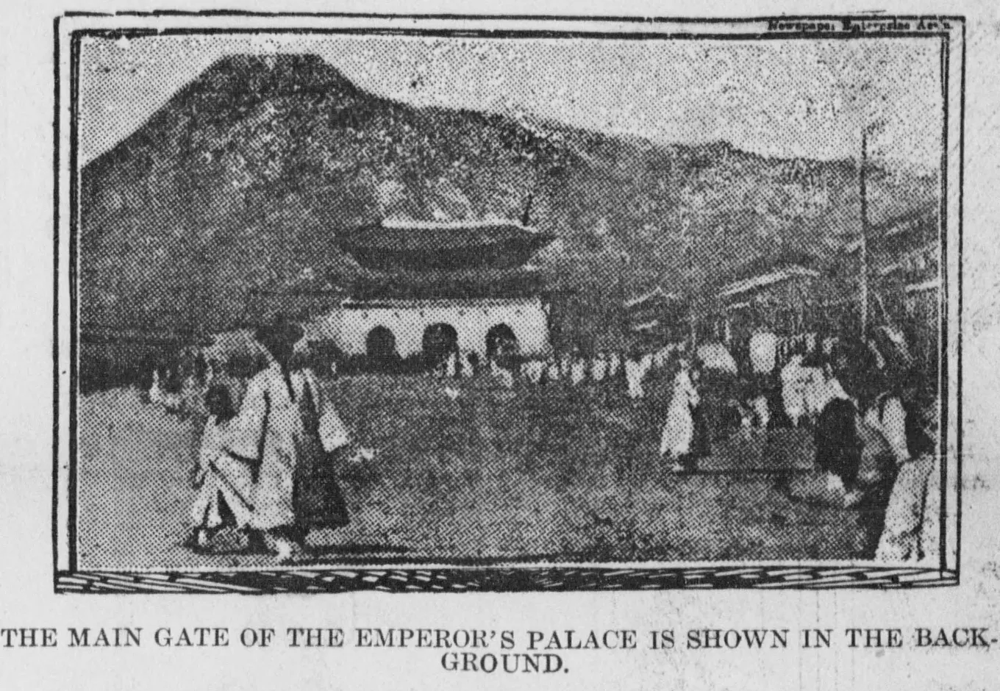
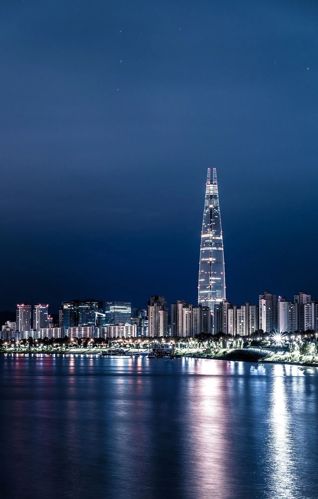

Here is an embarrassing confession for a man who already has a plane ticket: a few weeks ago, while [planning our 2026 trip to Korea and Japan](/2026/08/03-japan-2026-destination-menu/), I realised I could not name a single Korean king. Not one. I can recite the firing order of a straight-six engine and roughly forty ways to make a Python import throw a tantrum, but the entire past of a country I'm about to *fly into*? A blank tab.

So one night — the kind of night where you open one Wikipedia article "just to check the capital" — I typed *history of Korea* and did not resurface for three days.

This post is what I found, more or less in the order I fell over it. I'm not a historian; I'm a curious tourist with too many browser tabs and a weakness for old maps. So come with me. There's a bear. There's an alphabet a king designed *on purpose*. There's an admiral who won twenty-three battles and then, dying, asked everyone to please not mention it. Let's go.

But first, the thing that tripped me up most, so let me put it right up front: **for almost this entire story there was just *Korea* — one country.** A "North" and a "South" don't exist until the very end, after 1945; everything before that is the shared past of *both* of today's Koreas. So as I go, I'll keep a running **Korea count** at each stop, because "wait — is this one Korea or several right now?" turned out to be the most surprising thread in the whole thing.

> [!NOTE] How to read this
> I've kept the "wait, *really?*" moments in the little coloured boxes: **fun facts** where something delighted me, **meanwhile** boxes for what the rest of the planet was doing at the same time, and a few **"but is that true?"** boxes where the internet's favourite version turns out to be a bit of a fib. Everything here is my own crash course — corrections very welcome.

## It starts with a bear (and twenty cloves of garlic)

Every good origin story needs a founding myth, and Korea's is a banger. In the beginning there's Hwanung, a sky-god's son, who comes down to earth. A tiger and a bear turn up and beg to be made human. Hwanung hands them a bundle of mugwort and **twenty cloves of garlic** and lays down the rules: stay out of the sunlight for a hundred days, eat only this. The tiger — relatable — taps out almost immediately. The bear grits it out, and is rewarded by becoming a woman, Ungnyeo, who goes on to give birth to **Dangun**, the legendary founder of the first Korean kingdom, **Gojoseon**, in **2333 BCE**.

I love that the moral of the national founding myth is essentially *touch grass and eat your vegetables*.

> [!QUESTION] But is that actually history?
> No — and Koreans will tell you so. Dangun is a **founding myth**, not a date you can dig up. The oldest surviving record of the story, the *Samguk Yusa*, was written around **1281 CE** — roughly 3,600 years *after* the event it describes. (Please also ignore any claim that someone has found "Dangun's actual tomb"; scholars worldwide don't buy it.)

Here's the part that got me, though. That mythical 2333 BCE date wasn't just folklore — South Korea *officially counted its calendar from it*, the "Dangi" era, from 1948 all the way until 1961. It's also where you get the lovely round boast that Korea has "**5,000 years of history**." Myth or not, that's a *lot* of runway.

> [!INFO] Meanwhile, elsewhere on Earth (c. 2333 BCE)
> While a mythical bear-woman was founding Korea, real humans were busy too: **Sargon of Akkad** was assembling the world's first empire in Mesopotamia, the **Great Pyramid of Giza** was already about two centuries old, and over in Britain the big stones of **Stonehenge** were going up. Deep time is genuinely dizzying.

**Korea count: one — barely.** This is a single legendary kingdom, Gojoseon, sitting up in the north and looking nothing like the country on a modern map. But notionally, one Korea.

## Three kingdoms, and an alarming number of eggs

Fast-forward a couple of thousand years and the peninsula sorts itself into the **Three Kingdoms**: **Goguryeo** in the north (huge, stretching up into Manchuria), **Baekje** in the southwest, and **Silla** in the southeast — plus a smaller fourth wheel, the **Gaya** confederacy, down south. For centuries they fought, allied, betrayed, and swapped territory like a very violent group project.

The founding legends here are *gloriously* strange. Silla's first king, Bak Hyeokgeose, supposedly **hatched from a giant egg** delivered by a white horse. The Gaya kings? **Six eggs that floated down from the sky.** I went looking for kings and found an omelette.

> [!QUESTION] Careful with those dates
> You'll see neat founding dates — Silla 57 BCE, Goguryeo 37 BCE, Baekje 18 BCE. Those come from a 12th-century chronicle and are **traditional, not archaeological**. Historians think these actually jelled into real states a few centuries *later*. The eggs are, I regret to inform you, also not peer-reviewed.

It's Silla that eventually wins the group project. With help from Tang China, it knocks out Baekje in 660 and **Goguryeo in 668**, unifying most of the peninsula — and then, in a plot twist I enjoyed far too much, immediately turns around and **fights off its own Tang allies** to keep the place for itself.

> [!INFO] Meanwhile, across the same few centuries
> As Silla was unifying Korea, the Byzantine emperor **Constans II was murdered in his bath** in Sicily. And in the golden centuries that followed — Silla raised the temple of Bulguksa around **751** — **Charlemagne** was crowned emperor in Rome (800) while European monks were codifying the plainsong we now call **Gregorian chant**. Everybody, everywhere, was having an eventful few hundred years.

**Korea count: three** (four, if you count little Gaya) — a peninsula of rival kingdoms, emphatically *not* a single Korea. That is, until Silla swallows the lot in **668**. Circle that year: it's when "one Korea" is genuinely born for the first time.

## Unified Silla, and a city the size of a legend

For nearly three centuries, **Unified Silla** (668–935) runs the show, with its capital at **Gyeongju** — a city so large and rich that it's remembered as one of the biggest on the planet at the time. This is peak Buddhist Korea: the era that gave us the Seokguram Grotto and the temple of **Bulguksa**, with its two famous stone pagodas.

(Up north, meanwhile, a kingdom called **Balhae** rose from the ashes of Goguryeo — though whether to file Balhae under "Korean" or "not" is a fight Korean and Chinese historians are still having. I backed away slowly from that particular tab.)

**Korea count: one… ish.** With Balhae holding the north, historians literally call these centuries the *Northern and Southern States* period — two Korean states sharing one peninsula. If "a Korea split into a north and a south" sounds eerily familiar, hold that thought for about 1,300 years.

## Goryeo — the dynasty that gave us the word "Korea"

In **918**, a general named Wang Geon founds a new dynasty: **Goryeo**. And here's the little lightning bolt I did not expect — *this is literally where the word "Korea" comes from.* Goryeo → Corea → Korea, carried west along the trade routes by Arab and Persian merchants. I have been saying the name of this dynasty my whole life without knowing it.

Goryeo is a flex of a dynasty. Its **celadon** ceramics — that glowing greenish glaze above — were considered *finer than China's*, which was the medieval equivalent of out-engineering the market leader. (For a sense of *when* that is: the same 12th century when troubadours were inventing courtly love songs in southern France, and the first great written harmonies were echoing through a half-built **Notre-Dame de Paris**.) But two things here made me actually sit up.

> [!TIP] The bit that made me put my coffee down
> The **Tripitaka Koreana** is the entire Buddhist canon hand-carved onto **more than 81,000 wooden printing blocks** in the 1230s–40s — around **52 million characters**, so consistent they look like the work of a single hand. It was carved as a *prayer* for protection from the invading Mongols. And the 15th-century wooden halls it still lives in keep it from rotting after ~600 years using **nothing but clever natural ventilation**. No sensors, no climate control. Just really, really good design.

And then the one that genuinely stopped me:

> [!TIP] Korea beat Gutenberg by 78 years
> The **Jikji**, printed in **1377**, is the world's oldest surviving book made with **movable metal type** — printed **78 years before the Gutenberg Bible**. Only its second volume survives, and it lives today in the national library of *France*. I did not have "Korea invented metal-type printing first" on my bingo card.

> [!QUESTION] Before I oversell it
> Two honest caveats I made myself write down: there's **no evidence** Korea's invention influenced Gutenberg's, and it didn't set off a printing explosion the way Europe's press did. First is not the same as most influential. Still ridiculously cool.

> [!INFO] Meanwhile, in 1377
> As the Jikji came off the press, **Pope Gregory XI was moving the papacy back to Rome** from Avignon, and a London civil servant named Geoffrey Chaucer was still a decade away from starting *The Canterbury Tables*… sorry, *Tales*. And in France, **Guillaume de Machaut** — the towering composer of the 1300s — died that very year; musicologists still use his death to mark where one whole era of music ends and the next begins.

**Korea count: one.** Goryeo reunifies the peninsula and — as above — hands the country the very name we still use. One Korea, and now it even sounds like it.

## Joseon — the dynasty that just would not quit

In **1392**, a general (there's always a general) named Yi Seong-gye topples Goryeo and founds the **Joseon** dynasty — which then runs, astonishingly, for **more than five centuries**. He moves the capital to Hanyang, which you know today as **Seoul**, and makes stern **Neo-Confucianism** the operating system of the entire society.

Joseon is also where Korea picks up its most poetic nickname, the "**Land of the Morning Calm**" — which, I was slightly heartbroken to learn, is a lovely *mistranslation* of the characters for Joseon rather than what they literally say. I'm keeping it anyway. It's too nice.

> [!INFO] Meanwhile, in 1392
> The very year Joseon began, **King Charles VI of France went abruptly, tragically mad** in a forest near Le Mans and attacked his own knights. Different continents, wildly different vibes.

**Korea count: one — and it stays that way for over five centuries.** From here right up to the 20th century there is exactly one Korea. This is the long, unbroken middle of the whole story.

### The king who sat down and *invented an alphabet*

If this whole rabbit hole had a main character, it's **King Sejong the Great** (r. 1418–1450). Korea at the time wrote using Chinese characters — thousands of them, learnable only by the elite with time and tutors. Sejong looked at his largely illiterate population and did something almost unheard of in history: he *designed a brand-new alphabet from scratch* so that ordinary people could actually read and write. It was presented in 1443 and promulgated in **1446** as **Hangul**.

And it's not just that it exists — it's *how good it is*. Hangul is often called a **featural** alphabet: the **shapes of the consonants are little diagrams of your mouth and tongue** making that sound. The design is so tidy that the linguist Geoffrey Sampson called it "one of the great intellectual achievements of mankind."

> [!QUOTE] From the introduction to the Hunminjeongeum, 1446
> "The sounds of our country's language are different from those of the Middle Kingdom… Among the ignorant people, there have been many who, having something they want to put into words, have in the end been unable to express their feelings. I have been distressed because of this, and have newly designed twenty-eight letters."

Twenty-eight letters then; **twenty-four** today. And the accompanying commentary contained the single most confident sentence I read in three days of this:

> [!QUOTE] Jeong Inji, on how easy Hangul is to learn (1446)
> "A wise man can acquaint himself with them before the morning is over; a stupid man can learn them in the space of ten days."

> [!QUESTION] Two myths I had to unlearn
> First, Hangul was **not** instantly loved. The Confucian scholar-elite thought a people's alphabet was vulgar and **resisted it for centuries**; it only really won in the late 1800s–1900s. Second, despite what you'll read, the letters were **not** modelled on window lattices or floor tiles — that commentary (rediscovered in 1940!) plainly says they're based on the speech organs. It's also *one of the few* scripts with a known inventor, not the only one — Cherokee has one too.

> [!INFO] Meanwhile, in the 1440s
> While Sejong was perfecting a democratic alphabet, in Mainz a goldsmith named **Johannes Gutenberg was tinkering toward his printing press**; in Florence, the composer **Guillaume Du Fay** unveiled a shimmering motet for the consecration of Brunelleschi's brand-new cathedral dome (**1436**); and Constantinople had barely a decade left before it fell to the Ottomans in 1453. The 15th century was *pushing* on both ends of the world at once.

### The admiral who never lost a battle

The other Joseon hero I fell for is **Admiral Yi Sun-sin**. When Japan's warlord Toyotomi Hideyoshi invaded in **1592** — planning to march through Korea and conquer Ming China — Yi met him at sea and simply… never lost. Across the seven-year **Imjin War**, he fought **twenty-three naval battles and won all twenty-three**, often absurdly outnumbered.

His most famous weapon is the **turtle ship** (*geobukseon*): a warship with a roofed-over deck bristling with **iron spikes** so no one could board it, and a dragon's head at the prow. And his most famous moment might be this line, written to his king after a political rival had gotten most of the fleet destroyed, leaving Yi with almost nothing:

> [!QUOTE] Admiral Yi Sun-sin, 1597
> "Your humble servant still commands no fewer than twelve ships… Even though our navy is small, I promise you that as long as I live, the enemy cannot despise us."

He then won anyway, at Myeongnyang, with those twelve-odd ships against a fleet of over a hundred. He was killed in the *final* battle of the war, and his last order is the kind of thing that sounds invented but isn't:

> [!QUOTE] Yi Sun-sin's last words, Battle of Noryang, 1598
> "The war is at its height — beat my war drums. Do not announce my death."

> [!QUESTION] The turtle ship reality check
> I badly wanted the popular claim — "the world's first ironclad warship!" — to be true. Historians are genuinely split, and no source from Yi's own time actually says it was iron-*plated* (the documented iron bit is the anti-boarding *spikes*). Also, slightly deflating: at Myeongnyang, his greatest victory, there were **no turtle ships present at all**. Yi's real superpower was tactics, not gadgets.

> [!INFO] Meanwhile, in 1592
> As Yi was sinking fleets, a playwright named **William Shakespeare** was making his name in London — four years after England saw off the **Spanish Armada** (1588) — while in the churches of Rome and London the last great masters of Renaissance polyphony, **Palestrina** and **William Byrd**, were at their peak. The 1590s were a big decade for men making dramatic things: on the stage, on the page, and at sea.

## The Hermit Kingdom, and a map I fell in love with

After being invaded by Japan and then twice by the Manchus, Joseon did what a lot of us would do after a bad few decades: it **closed the curtains**. For much of the 1600s–1800s it kept foreigners firmly at arm's length, which earned it the Western nickname the "**Hermit Kingdom**" (from an 1882 book title, it turns out — *Corea: The Hermit Nation*).

This is the map that broke me. In **1861**, a cartographer named Kim Jeong-ho carved the entire peninsula — mountains, roads, coastlines — onto woodblocks so it could be **printed and folded like an atlas**. A closed kingdom producing one of the most beautiful maps of itself is the kind of quiet contradiction I can't stop thinking about.

> [!INFO] Meanwhile, in 1861
> As Korea was mapping itself in exquisite detail, the **United States was tearing itself apart** — the American Civil War began that April — while across the Atlantic, opera ruled the age: **Verdi** in Italy, and **Wagner** just finishing the epochal *Tristan und Isolde*. History has *terrible* comedic timing.

The curtains didn't hold. In **1876**, Japan did to Korea almost exactly what the US Navy had done to Japan two decades earlier: sailed in with warships and forced open a treaty. The modern world had arrived, and it was not asking politely.

## An empire, and then a boot on the neck

In a last, defiant bid for respect, King **Gojong** upgraded the whole country: in **1897** he declared the **Korean Empire** and named himself emperor, launching a burst of frantic modernisation. (Elsewhere that same year: Britain was throwing **Queen Victoria's Diamond Jubilee**, **Brahms** died in Vienna, and in America a jaunty new syncopated sound — **ragtime** — was just catching on.)

It didn't last. The bigger powers had other plans, and after winning wars against China and then Russia, Japan moved in: a "protectorate" in **1905**, and then, on **22 August 1910**, outright **annexation**. The Korean Empire, thirteen years old, was erased from the map.

> [!INFO] Meanwhile, in 1910
> The year Korea lost its independence, **Halley's Comet** was blazing across the world's skies and both **Leo Tolstoy** and **King Edward VII** died — and in Paris, **Stravinsky**'s *Firebird* was setting the ballet world alight. A big, ominous year to vanish from the atlas.

**Korea count: still one** — a kingdom, then briefly an empire, then a colony, but a *single* Korea the entire way through. Which is exactly what makes the next bit so jarring: Korea is about to be split for the first time in nearly 1,300 years.

## Thirty-five years erased — and a single, enormous "No"

From **1910 to 1945**, Korea was a Japanese colony, and the policy hardened over time into an attempt to erase Korean identity outright: the language suppressed in schools, Koreans **pressured to adopt Japanese names**, and — in the war years — forced labour and the horror of the so-called "comfort women." This is the heavy chapter, and I'm not going to make jokes in it.

What I *didn't* know was how loudly Koreans said no. On **1 March 1919**, thirty-three activists signed a **Declaration of Independence**, and the whole country poured into the streets shouting **"Mansei!"** ("may Korea live ten thousand years"). It was peaceful. It was enormous. It was crushed — hard — but it lit a fire: a Korean government-in-exile formed in Shanghai that same year, and it even helped inspire China's own May Fourth Movement weeks later. A teenage girl named **Yu Kwan-sun** became its lasting martyr, dying in prison at seventeen.

> [!INFO] Meanwhile, in 1919
> The world was redrawing itself at the **Treaty of Versailles**, and US President Wilson was talking loudly about the "self-determination of peoples" — a phrase Koreans had heard, and were now testing against the reality that nobody with power was coming to help. (In the background, a brand-new sound had just been pressed onto records for the first time — **jazz** — and the world was about to dance its way through the 1920s.)

## A line drawn in half an hour

Then, in August 1945, it was suddenly over: Japan surrendered, and Korea was free after 35 years. Liberation. Except — and this is the part that made me actually say "you're kidding" out loud — the *way* the peninsula was split is almost unbearably casual.

With Japan collapsing, two young American officers were given a **National Geographic map** and about **thirty minutes** to decide where the US and USSR should each accept the Japanese surrender. They looked for a convenient line, spotted the **38th parallel**, and drew it. One of them, **Dean Rusk**, later admitted they split the country with no real thought to Korean wishes. And here's the cruel twist: the line was only ever meant to be **temporary** — a tidy way to divide up *who accepted the Japanese surrender*, Americans below the 38th parallel, Soviets above it. Administrative housekeeping, not a border. Nobody asked a single Korean. But the Cold War set like concrete around it, and that half-hour decision is, more or less, why there are two Koreas today.

By **1948** the split had hardened into two states: the **Republic of Korea** in the south (August, under Syngman Rhee) and the **Democratic People's Republic of Korea** in the north (September, under Kim Il Sung). Two governments, one people, one hastily-drawn line.

**Korea count: two — for the first time since 668.** This is *the* separation, and it's worth being clear about what it is and isn't: not an ancient ethnic rivalry, not a natural fault line, but a Cold-War border drawn by outsiders in 1945 and frozen into two rival states by 1948. Everything above this point is the shared history of *both* Koreas; from here the story forks — and, true to its title, this post follows the southern branch, the **Republic of Korea**.

## The war that technically never ended

On **25 June 1950**, North Korea invaded the South, and the Korean War began. I'll be honest: I'd always mentally filed this as a smaller Cold War sidebar. It was not. It was **catastrophic** — commonly estimated at **over 2.5 million dead**, mostly civilians — and Seoul itself changed hands **four times**.

, via Wikimedia Commons.")

There are astonishing stories in here. General MacArthur's risky **landing at Incheon** in September 1950 flipped the whole war overnight. Then China poured across the Yalu River and flipped it back. And in the freezing December retreat, a single American cargo ship, the **SS Meredith Victory**, crammed on **around 14,000 refugees** — that photo above — and carried every one of them to safety. They called it the Ship of Miracles.

It ended on **27 July 1953** — except "ended" is the wrong word. It stopped with an **armistice**: a ceasefire, not a peace treaty. South Korea's president refused to even sign it. The two Koreas are, to this day, **technically still at war**, staring at each other across the **DMZ** — a strip of no-man's-land that has since accidentally become one of the most pristine wildlife sanctuaries on the peninsula, which is a bleak kind of miracle.

> [!QUOTE] President Eisenhower, on the 1953 armistice
> "We have won an armistice on a single battleground — not peace in the world."

> [!INFO] Meanwhile, in 1950
> The Cold War was freshly set: **NATO** and **Mao's People's Republic of China** were each barely a year old, and back in the United States, **McCarthyism** was hunting for communists under every bed. And **rock 'n' roll didn't exist yet** — Elvis Presley was a shy fifteen-year-old, and the sound that would define the century was still about five years away.

**Korea count: two, and stuck there.** The war was the North's attempt to force the country back into *one* by the gun. Three years and millions of lives later, the border had barely moved — two Koreas in, two Koreas out, only now with a fortified scar between them.

## The Miracle on the Han

Here is the fact that reframed everything for me. In **1960**, after colonisation and a war that flattened the country, South Korea's GDP per person was about **$158 a year** — poorer than much of sub-Saharan Africa. It was, by the numbers, one of the poorest places on Earth.

Today it's around **$37,000** and South Korea is a top-15 global economy that exports ships, semiconductors, cars, phones, and — as we'll get to — pop culture by the container-load. That leap is so steep it has a name: the **Miracle on the Han River**.

> [!TIP] Let that sink in
> That's roughly a **30-fold rise in real living standards inside one lifetime.** People who were born in mud-floored villages with no electricity have grandchildren carrying Samsung phones that those same grandchildren's *companies* designed. I don't think we have many stories like it. *(The headline dollar figures are nominal, so inflation flatters them — but even stripped back, the real growth is staggering.)*

How? Ruthlessly, is how. The architect was **Park Chung-hee**, an army general who seized power in a **1961 coup** and ran the country with an iron grip until 1979. He poured the state's energy into export industries and into the **chaebol** — the giant family conglomerates you know today: **Samsung**, **Hyundai**, **LG**. He also launched the **Saemaul Undong**, a "New Village Movement" that rebuilt the countryside on three slogans: *diligence, self-help, cooperation*.

It worked, and it came at a real cost: this was a **dictatorship**, with censorship, secret police, and crushed dissent. Park's own intelligence chief shot him dead over dinner in 1979. The economic miracle and the political darkness are the same story, and I don't think you're allowed to tell just half of it.

## The people take it back

What genuinely moved me was learning that South Korea's democracy wasn't handed down — it was **demanded, in the street, repeatedly.** After Park's death another general, Chun Doo-hwan, grabbed power and in **1980** brutally suppressed an uprising in the city of **Gwangju**, killing hundreds (the true number is still contested).

The pressure kept building until **June 1987**, when the death-by-torture of a student named Park Jong-chul spilled millions of ordinary people — office workers, not just students — into nationwide protests. This time the regime blinked, and agreed to **direct presidential elections**. That's the system South Korea still uses today. Democracy there is barely older than I am, and they fought for every year of it.

Then came the coming-out party:

> [!INFO] Meanwhile, in 1988
> South Korea hosted the **Seoul Summer Olympics** — a record turnout of around 159 nations, and a global debut announcing "we have arrived." Its official song — Koreana's **"Hand in Hand"**, produced by Giorgio Moroder — actually hit **number one across much of Europe**, an early flicker of the Korean pop wave decades before BTS. The timing was uncanny: the Soviets had just started pulling out of Afghanistan, the song literally sang about "breaking down the walls," and the **Berlin Wall would fall the very next year.** The old world order was ending on live television.

## Nearly bankrupt — and then a nation empties its jewellery box

I'd never heard this story, and now I can't stop telling people. In **1997**, the Asian financial crisis hit and South Korea came within a breath of **national bankruptcy**, forced into a record IMF bailout.

What happened next is almost unbelievable: the government asked citizens to donate gold to help pay down the debt, and **around 3.5 million people lined up to hand over their wedding rings, their kids' first-birthday rings, their sports medals.** Roughly **227 tonnes** of it. Cardinal Kim Sou-hwan reportedly gave his gold cross. It became a national ritual of *we got ourselves into this together, we'll dig out together* — and Korea repaid the IMF **years early**.

## And then the whole world pressed "play"

Here's where my rabbit hole finally caught up to things I actually recognised. Starting in the late 1990s, Korea began exporting *culture* — the **Hallyu**, or "Korean Wave" — and it went from a regional curiosity to a planetary force with almost rude speed:

- **2012:** PSY's *Gangnam Style* becomes the **first video ever to hit one billion YouTube views**, and my entire office does the horse-dance at the Christmas party.
- **2020:** Bong Joon-ho's *Parasite* becomes the **first non-English-language film to win the Best Picture Oscar** — in the Academy's 92-year history.
- **2020:** **BTS**'s "Dynamite" hits **number one** on the US Billboard Hot 100.
- **2021:** *Squid Game* becomes Netflix's biggest launch ever, reaching **number one in 94 countries.**

> [!QUOTE] Bong Joon-ho, at the Golden Globes (January 2020)
> "Once you overcome the one-inch-tall barrier of subtitles, you will be introduced to so many more amazing films."

And let's not forget **2002**, when South Korea co-hosted the **FIFA World Cup** with — of all countries, given everything above — **Japan**, and stunned the planet by reaching the **semifinals**, the first Asian team ever to get that far.

## What I actually came away with

I opened that first tab expecting to memorise a few dynasties for a trip. What I got instead was a story with an almost unfair narrative arc: a bear, a home-made alphabet, an undefeated admiral, thirty-five stolen years, a line drawn in half an hour, a war that never officially ended, and then — from the ashes of literally being one of the poorest countries on earth — a sprint to the front of the modern world, powered as much by stubbornness and street protests as by semiconductors.

The bit I'll carry with me: nearly every good thing in that last stretch was **taken, not given** — the alphabet handed to commoners over the elite's objections, the democracy wrung out of a dictatorship one protest at a time, the debt paid off with wedding rings. That's a national personality you can feel, and now I desperately want to go feel it in person.

And the fact I keep turning over: **for almost all of those 5,000 years, there was just one Korea.** The two-Koreas reality is the newest, rawest, most unfinished chapter — barely older than my parents. Which somehow makes the DMZ feel less like ancient destiny and more like a wound nobody has been allowed to close.

So when we land in Seoul in 2026, I'll be the tourist getting quietly emotional at a pagoda in **Gyeongju**, squinting at signs and grinning because I can *sort of* sound out Hangul now, and standing at the **DMZ** thinking about a National Geographic map and half an hour that split a people in two. Not bad for three nights of lost sleep.

If you've got a favourite corner of Korean history I glossed over — or I've fumbled something — please tell me. I've clearly got the tabs open anyway.

## A note on the pictures (and where all this came from)

I wanted this post to be illustrated but honest, so **every image here is either public domain or released under CC0** and pulled from **[Wikimedia Commons](https://commons.wikimedia.org/)**. In order of appearance:

- **Cover — *Irworobongdo* ("Sun, Moon and Five Peaks")**, the screen that stood behind the Joseon throne. Public domain. [File page](https://commons.wikimedia.org/wiki/File:Irworobongdo.jpg)
- **Goguryeo tomb mural** (hunting scene), unknown artist, ~5th–6th c. Public domain. [File page](https://commons.wikimedia.org/wiki/File:Goguryeo_tomb_mural.jpg)
- **Dabotap pagoda, Bulguksa** — photo by Bernard Gagnon. CC0. [File page](https://commons.wikimedia.org/wiki/File:Dabotap_Pagoda_01.jpg)
- **Goryeo celadon *maebyeong* bottle** (British Museum) — photo by 14GTR. CC0. [File page](https://commons.wikimedia.org/wiki/File:Bottle_of_the_Goryeo_period%2C_British_Museum_01.jpg)
- **Hunminjeongeum Haerye** (the 1446 text introducing Hangul). Public domain. [File page](https://commons.wikimedia.org/wiki/File:Hunminjeongeumhaerye.jpg)
- **"Welcoming the Pyeongan Governor"**, attributed to Kim Hong-do. Public domain. [File page](https://commons.wikimedia.org/wiki/File:Kim_Hong-do%2C_Welcoming_the_Pyeongan_Governor_%28all%29.jpg)
- **Daedongyeojido**, Kim Jeong-ho's 1861 map of Korea. Public domain. [File page](https://commons.wikimedia.org/wiki/File:Daedongyeojido-full.jpg)
- **Main gate of the imperial palace, Seoul, 1904.** Public domain. [File page](https://commons.wikimedia.org/wiki/File:Main_gate_of_the_Emperor%27s_Palace%2C_Seoul_%281904%29.jpg)
- **Refugees aboard the SS Meredith Victory, December 1950** — U.S. Navy photo (NH 95597). Public domain. [File page](https://commons.wikimedia.org/wiki/File:Korean_refugees_aboard_SS_Meredith_Victory_in_December_1950_%28NH_95597%29.jpg)
- **Seoul skyline at night, 2018** — photo by mauveine.kim. CC0. [File page](https://commons.wikimedia.org/wiki/File:Seoul_Skyline_Night_2018.jpg)

As for the facts: this is a beginner's synthesis, cross-checked against Wikipedia, UNESCO, Britannica, the World History Encyclopedia, national museums, and the World Bank. Where the popular story and the historians disagreed, I tried to side with the historians — but I'm a tourist, not an authority, so treat the "but is that true?" boxes as the spirit of the whole thing.
