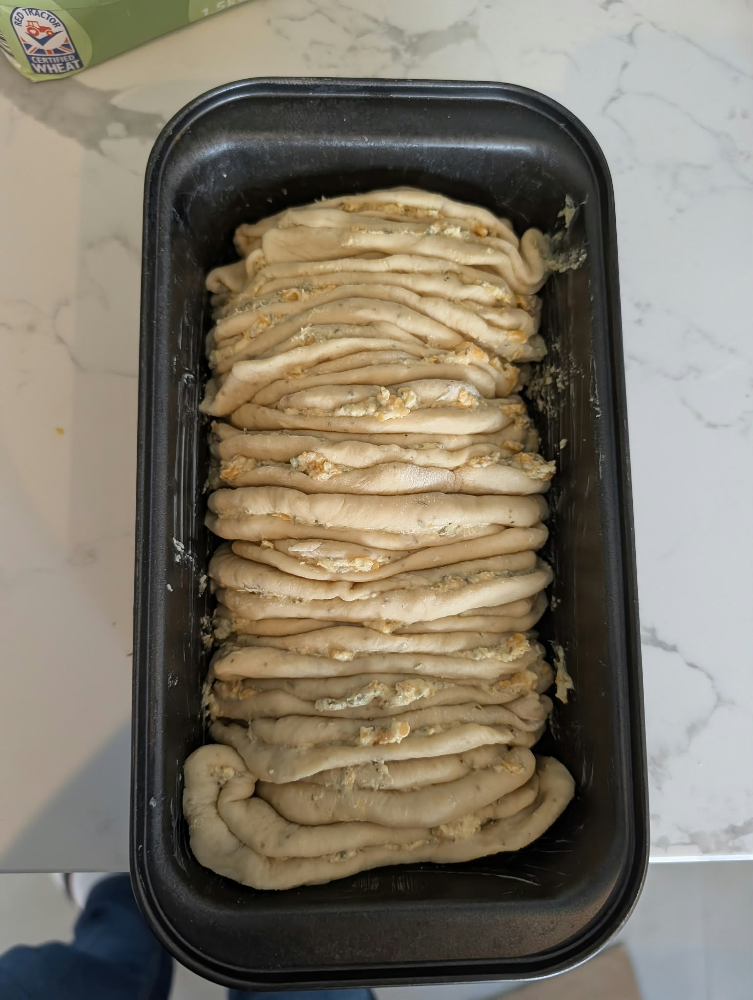
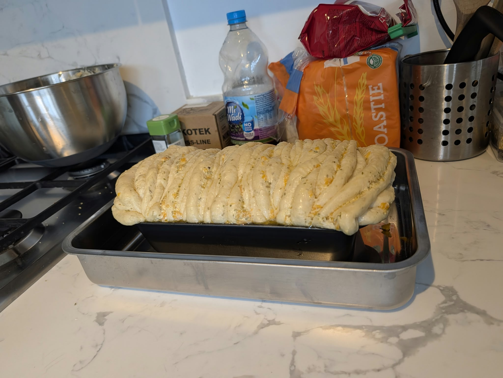

There is a specific kind of bread that does not get sliced. You tear a piece off the top, someone else takes the next one, and within four minutes the loaf has been disassembled by hand and nobody feels bad about it.

This is that bread. Twelve rounds of soft enriched dough, each one spread with rosemary-garlic butter, showered in cheese, **folded in half**, and stood up side by side in a loaf pan like files in a drawer. They bake into a single loaf that comes apart along every fold.

The recipe is adapted from [Sally's rosemary garlic pull-apart bread](https://sallysbakingaddiction.com/rosemary-garlic-pull-apart-bread/) at Sally's Baking Addiction. I have converted it to metric, explained what every ingredient is actually doing, and written down what happened on my own bake.

> [!NOTE]
> **The honest headline:** this takes about four hours, but only forty minutes of that involves you. The rest is the dough working unsupervised. The [three grids](#-the-recipe-as-three-small-recipes) below are built around that gap.

## 🍞 Recipe at a Glance

| | |
| --- | --- |
| Hands-on time | About 40 minutes |
| Yeast bloom | 5–10 minutes |
| First rise | 60–90 minutes |
| Second rise | 45 minutes |
| Bake | About 50 minutes at 177 °C (350 °F) |
| Total time | About 4 hours |
| Yield | One loaf, 12 pieces |
| Pan | 23 × 13 cm (9 × 5 inch) loaf pan, oven rack in the lower third |
| Difficulty | Moderate — no tricky technique, but it needs a plan |

## 🛒 Ingredients and Why They Are There

### The Dough

| Ingredient | Quantity | What it does |
| --- | --- | --- |
| Instant yeast | 2 teaspoons | Eats the sugars and exhales carbon dioxide and ethanol. The gas inflates the dough, the ethanol and its by-products supply most of the flavour |
| Granulated sugar | 1 tablespoon | Gives the yeast an immediately available meal during the bloom, then helps the crust brown |
| Whole milk, warmed to 43 °C | 180 ml (¾ cup) | Hydrates the flour so gluten can form. Milk rather than water adds fat for softness, sugars for browning, and proteins that keep the crumb tender |
| Unsalted butter, softened | 3 tablespoons (43 g) | Coats gluten strands so they slide past each other, which is what makes an enriched dough pillowy instead of crusty |
| Large egg | 1 | The richness. Yolk brings fat and lecithin for a tender crumb that stays soft; white brings protein for structure and a deeper crust colour |
| All-purpose flour | 291 g (2⅓ cups), plus more as needed | Supplies the gluten proteins that trap gas and give the crumb its chew. All-purpose is deliberate — bread flour would make this tougher than a pull-apart loaf wants to be |
| Salt | 1 teaspoon | Seasons, tightens the gluten network, and slows the yeast so the rise is steady rather than frantic |
| Garlic powder | 1 teaspoon | Background garlic, evenly distributed through every crumb. Dehydrated garlic survives a 50-minute bake without scorching, which fresh garlic in the dough would not |
| Fresh rosemary, finely chopped | 1 tablespoon | Puts the herb *inside* the bread rather than only between the layers, so you taste it even in a bite that misses the butter |

### The Herb Butter and Cheese

| Ingredient | Quantity | What it does |
| --- | --- | --- |
| Unsalted butter, extra soft | 71 g (5 tablespoons) | The layer separator. It keeps each fold from welding shut, so the loaf pulls apart cleanly, and it carries the herbs and garlic into the crumb |
| Fresh rosemary, finely chopped | 1 tablespoon | The headline flavour. Its aromatic oils are fat-soluble, so butter is exactly the right vehicle |
| Fresh parsley, finely chopped | 1 tablespoon | Cuts the richness and stops the loaf reading as purely beige |
| Garlic cloves, minced | 2 | Raw and sharp, which is the point — this is the bright garlic note that powder cannot give you |
| Salt | ¼ teaspoon | Seasons the butter itself. Most of the seasoning you taste comes from here, not from the dough |
| Shredded parmesan, mozzarella, or white cheddar | 95 g (¾ cup) | Savoury depth and browned, crisp edges where it escapes. Parmesan is the sharpest, mozzarella the stretchiest, white cheddar somewhere between |

### The Finish

| Ingredient | Quantity | What it does |
| --- | --- | --- |
| Unsalted butter, melted | 1 tablespoon (14 g) | Brushed on hot, it softens the crust and gives the loaf its gloss |
| Coarse or flaky sea salt | A pinch | Lands on the surface undissolved, so you get bright salt hits rather than uniform saltiness |

> [!TIP]
> Shred the cheese yourself. Bagged shredded cheese is dusted with starch or cellulose to stop it clumping, and that coating shows up as a slightly grainy, less clean melt.

## 🧠 The Recipe as Three Small Recipes

Ingredients with quantities down the left, operations merged across the rows they consume. Read a row rightwards to see where that ingredient ends up; read a cell downwards to see everything that goes into it.

Splitting it into three means you never have to hold the whole thing at once. Each grid is a self-contained job with its own finish line, and the second one fits entirely inside the first one's waiting time.

### 1 · The Dough


caption: "Grid 1 — the dough"
ingredients:
  - "2 tsp instant yeast"
  - "1 Tbsp granulated sugar"
  - "180 ml (¾ cup) whole milk, warmed to 43 °C (110 °F)"
  - "3 Tbsp (43 g) unsalted butter, softened"
  - "1 large egg"
  - "291 g (2⅓ cups) all-purpose flour, plus more as needed"
  - "1 tsp salt"
  - "1 tsp garlic powder"
  - "1 Tbsp fresh rosemary, finely chopped"
steps:
  - col: 1
    from: 1
    to: 3
    label: "whisk · leave until frothy"
    time: "5–10 min"
  - col: 2
    from: 1
    to: 9
    label: "beat on low until the dough pulls from the bowl"
    time: "about 3 min"
  - col: 3
    from: 1
    to: 9
    label: "knead to the windowpane test"
    time: "5 min"
  - col: 4
    from: 1
    to: 9
    label: "rise in a greased bowl until doubled"
    time: "60–90 min"


The dough should stay soft and a little tacky. Add flour a tablespoon at a time only while it is sticking to the bowl — a dry dough bakes into a dry loaf. Once the timer is set, go straight to grid 2: it takes five minutes and you have at least an hour.

### 2 · The Herb Butter and Cheese


caption: "Grid 2 — the filling, made during the first rise"
ingredients:
  - "71 g (5 Tbsp) unsalted butter, extra soft"
  - "1 Tbsp fresh rosemary, finely chopped"
  - "1 Tbsp fresh parsley, finely chopped"
  - "2 garlic cloves, minced"
  - "¼ tsp salt"
  - "95 g (¾ cup) shredded parmesan, mozzarella or white cheddar"
steps:
  - col: 1
    from: 1
    to: 5
    label: "mix to a smooth compound butter"
  - col: 2
    from: 1
    to: 6
    label: "keep both at room temperature until the dough has doubled"


One bowl and a fork, if the butter is soft enough. Keep the cheese separate — it gets sprinkled, not mixed in. Do not refrigerate the butter unless you are making it well ahead; cold butter tears the dough rounds instead of spreading over them.

### 3 · Assembly, Bake and Finish


caption: "Grid 3 — assembly through to the table"
before:
  - "Grease a 23 × 13 cm (9 × 5 in) loaf pan · set the oven rack to the lower third"
ingredients:
  - "the risen dough, from grid 1"
  - "the herb butter, from grid 2"
  - "the shredded cheese, from grid 2"
steps:
  - col: 1
    from: 1
    to: 1
    label: "punch down · divide into 12 · flatten to 10 cm rounds"
  - col: 2
    from: 1
    to: 2
    label: "spread 1–2 tsp on each round"
  - col: 3
    from: 1
    to: 3
    label: "sprinkle 1 Tbsp on each · fold in half"
  - col: 4
    from: 1
    to: 3
    label: "line up round-side-up in the pan · rise · preheat the oven"
    time: "45 min"
  - col: 5
    from: 1
    to: 3
    label: "bake at 177 °C"
    time: "about 50 min"
after:
  - "Brush with 1 Tbsp (14 g) melted butter · sprinkle flaky sea salt · cool 10 min in the pan"


Three things these grids make obvious that a numbered list hides.

**Only about forty minutes of the four hours need you.** Three cells are almost entirely waiting — *rise until doubled* at 60–90 minutes, *rise* at 45 minutes, and *bake* at roughly 50. Set a timer at each of those three and go do something else.

**Grid 2 is free.** Nothing in it competes for the oven or the clock, so it slots in anywhere inside grid 1's first rise. Two of the three grids are finished before the oven is even on.

**Give the bake two timers, not one.** Set 25 minutes, look at the colour, tent with foil if the top is running ahead, then set 25 more. Splitting it into two decisions means "check on the bread at some point" never has to live in your working memory.

> [!IMPORTANT]
> **This dough is forgiving about lateness.** If you lose the first rise by half an hour, it is fine — punch it down and continue. If you lose it by two hours, it is still usually fine, just a little more sour and a little less lofty. Overshooting the *second* rise matters more, because an over-proofed loaf can collapse in the oven. If you are going to be distracted, be distracted during grid 1's rise.

## 🍳 Method

### 1. Bloom the Yeast

Put the yeast and sugar in the bowl of a stand mixer. Warm the milk to about **43 °C (110 °F)** — warm to a fingertip, not hot — and pour it over. Whisk gently, cover with a towel, and leave for **5–10 minutes** until the surface is frothy.

Much above 50 °C and you start killing the yeast; much below body temperature and it takes its time.

### 2. Mix and Knead

Add the butter, egg, flour, salt, garlic powder, and rosemary. Beat on low for about **3 minutes**, until the dough comes together and pulls away from the sides of the bowl. If it will not pull away, add flour a tablespoon at a time.

Knead for a full **5 minutes**, in the mixer with a dough hook or by hand on a lightly floured surface. The dough should stay soft and slightly tacky.

Test it two ways. Poke it: if it springs back slowly, it is ready. Or tear off a golf-ball-sized piece and stretch it thin — if light passes through before it tears, the gluten is developed. That is the **windowpane test**.

### 3. First Rise

Shape the dough into a ball, put it in a greased bowl, cover, and leave somewhere slightly warm until doubled — **60–90 minutes**.

### 4. Make the Filling

While the dough rises, mix the soft butter, rosemary, parsley, garlic, and salt into a smooth compound butter. Keep it at room temperature. Shred the cheese and set it aside separately.

### 5. Assemble

Grease the loaf pan.

Punch the dough down and divide it into **12 equal pieces**, each about a quarter cup and a little bigger than a golf ball. With floured hands, flatten each into a round about **10 cm (4 inches)** across. They do not need to be perfect circles.

Spread **1–2 teaspoons** of herb butter onto each round, sprinkle each with about **1 tablespoon** of cheese, then **fold the round in half**.

Line the folded half-moons up in the pan, **round side up**, standing against each other.

> [!TIP]
> Weigh the dough and divide by twelve. Eyeballing it gives you three giant rounds and nine small ones, and the big ones will still be doughy when the small ones are dry.

### 6. Second Rise and Bake

Cover and let rise until puffy, about **45 minutes**. Set the oven rack to the **lower third** and preheat to **177 °C (350 °F)** during this rise.

Bake for about **50 minutes**, until deep golden. Tent loosely with foil if the top is running ahead.

Melted butter around the sides of the loaf during baking is normal. It soaks back in before the end.

### 7. Finish

Move the pan to a wire rack. Brush the top with melted butter and sprinkle with flaky sea salt. Cool for **10 minutes in the pan**, then turn it out and serve warm.

## 🥚 My Version: Two Small Eggs and More Flour

The recipe calls for one large egg. Mine were small, so two went in — and that made the dough noticeably wetter than it should have been, so it took extra flour to bring it back to something kneadable.

That is not really a deviation. Sally's ingredient list already says *"plus more as needed"* next to the flour, and the method says to add it *"a Tablespoon at a time."* The recipe expects you to chase the dough rather than trust the number. I just had a bigger gap to close than most people will.

Here is what the extra egg actually changes:

| Change | Why it happens | What to do about it |
| --- | --- | --- |
| Softer, richer crumb | Yolk contributes fat and lecithin, a natural emulsifier that helps butter and water stay mixed and keeps the crumb tender for longer | Nothing — this is the reason the recipe has an egg in the first place |
| Slightly more structure and colour | Egg white is mostly protein and water. The protein sets during the bake, and it browns well | Nothing, though you may reach your target colour a few minutes early |
| A wetter dough | Whole egg is roughly **75% water**. Going from one large egg to two small ones adds about 36 g of egg, which is around 27 g more water | Add flour by feel — see below |

**On the flour.** The dough as written runs at about **68% hydration**: 180 ml of milk is roughly 161 g of water, the egg adds about 38 g more, against 291 g of flour. Two small eggs push that to around **78%**.

Getting back to 68% takes roughly **40 g of extra flour** — which is about five tablespoons, and therefore exactly the "a tablespoon at a time" the recipe already tells you to do. I want to be straight with you: that is arithmetic from the water content, not a figure I measured on the day, and it assumes European small eggs at around 43 g shelled. I added flour a spoonful at a time until the dough stopped sticking to the bowl.

Which is genuinely the better instruction anyway. **Go by feel, not by the number.** Flour absorbs different amounts of water depending on brand, protein content, and how humid your kitchen is, so any figure I give you is a starting point rather than an answer. Stop while the dough is still soft and slightly tacky.

> [!IDEA]
> **The tidier way to do this.** If you only have small eggs, weigh them. One large egg is about 50 g out of the shell — so use one small egg plus a beaten spoonful of a second to make up the difference, and leave the flour alone. Less satisfying than the improvisation, but it lands you exactly where the recipe intended.

## 🔬 Why the Method Works

### Blooming the Yeast Is a Test, Not a Ritual

Instant yeast does not technically need to be dissolved first — it can go in dry with the flour. Sally blooms it anyway, in warm milk with a tablespoon of sugar, and waits for froth.

The froth is the point. It is visible proof the yeast is alive **before** you commit butter, an egg, and nearly three hundred grams of flour to the bowl. Yeast dies quietly in the back of a cupboard, and the alternative way to find out is a dough that never rises three hours later.

The sugar is there because yeast can use simple sugars immediately, while the starches in flour have to be broken down first. It is a head start rather than a meal.

### Garlic Twice, in Two Different Forms

Garlic powder goes in the dough. Fresh minced garlic goes in the butter. This is deliberate.

Cutting or crushing fresh garlic breaks its cells and lets the enzyme **alliinase** produce **allicin**, the compound behind that sharp, unmistakable raw-garlic bite. Allicin is unstable and heat breaks it down quickly into milder sulfur compounds — which is exactly what you want in the butter layers, where it mellows into something round and savoury.

In the dough, though, fresh garlic would spend fifty minutes at 177 °C with nothing to shield it. Dehydrated garlic has already had its volatile chemistry converted and stabilised, so it delivers an even, unburnt background note through the entire crumb. Two forms, two jobs.

### Rosemary Needs Fat

Rosemary's aroma comes largely from compounds like **cineole**, **camphor**, and **α-pinene**. They are oil-soluble, not water-soluble, so they disperse through butter far better than through a watery dough.

That is why the bulk of the rosemary goes into the compound butter, where it has 71 g of fat to dissolve into. The tablespoon in the dough is doing something different — it puts a low background note into the crumb itself, so a bite that misses a butter seam still tastes like the bread it belongs to.

### The Fold Is the Whole Trick

This is not a stacked loaf. Each round gets buttered, cheesed, and **folded in half**, and the half-moons are stood on edge in the pan, round side up.

Folding does two things at once. It creates a butter-filled seam inside every single piece, so each one pulls apart in your hand as well as away from its neighbours. And it turns a floppy disc into a self-supporting shape that stands up in the pan without slumping.

Standing them on edge means every fold reaches the top of the loaf. Heat gets down between them rather than only onto the surface, so the loaf bakes evenly — and every piece ends up with a browned, salted edge to grab.

The butter between the layers is what keeps them from merging. Fat physically separates the dough surfaces and cannot form gluten bonds across the gap, so the folds bake as neighbours rather than fusing into one mass.

> [!INFO]
> **Fun fact:** this is the same principle as lamination in croissants, run at much lower resolution. Both rely on layers of fat holding sheets of dough apart during the bake. A croissant has hundreds of paper-thin ones; this loaf has twelve thick ones and requires roughly none of the skill.

### Why the Butter Leaks and Then Does Not

Melted butter pooling around the loaf partway through the bake looks like a failure. It is not.

The filling melts long before the crumb has set, so some of it escapes to the edges of the pan. As the bake goes on and the starches gelatinise, the bread becomes able to absorb it again, and most of it soaks back in. What stays out crisps the crust against the hot pan, which is not a loss either.

### Why 177 °C and a Low Rack

177 °C is moderate for bread. Most lean loaves go in at 200 °C or above.

The reason is density. This loaf is buttered dough packed tight with cheese, and the middle takes a long time to heat. A hotter oven would set and darken the crust well before the centre was cooked. Dropping the temperature and stretching the bake to fifty minutes lets heat reach the middle in time.

The lower rack position does the same job from below — more heat into the base of the pan, where the loaf is thickest, and less radiant heat onto the top, which is already the first thing to brown.

## 🧯 Troubleshooting

| Problem | Likely cause | What to do |
| --- | --- | --- |
| Yeast never frothed | It is dead, or the milk was too hot | Start again with fresh yeast. Above about 50 °C kills it — test the milk on your wrist |
| Dough is sticky and unmanageable | Too much liquid, or eggs bigger than the recipe assumed | Add flour a tablespoon at a time until it clears the bowl, and stop while it is still soft |
| Dough is dry and tears when flattened | Too much flour, or it dried out uncovered | Add milk a tablespoon at a time, and keep the bowl covered during rises |
| Dough fails the windowpane test | Under-kneaded | Keep going. Five minutes is a minimum, not a maximum |
| Loaf is doughy in the middle | Oven ran cold, the rack was too high, or the rounds were uneven | Weigh the pieces. An instant-read thermometer should show about 88–93 °C in the centre |
| Top burned before the inside cooked | Oven ran hot, or no foil tent | Tent at the 25-minute mark, and check your oven against a separate thermometer |
| Folds fused into one solid loaf | Not enough butter in the seams, or it was melted rather than soft | Use properly softened, not melted, butter, and do not skimp |
| Butter pooled and stayed pooled | Usually just an early-bake stage | Give it time — most of it soaks back in. If it never does, the loaf was likely under-baked |
| Loaf collapsed in the oven | Over-proofed on the second rise | Stop the second rise when the loaf looks puffy, not fully doubled |

## 🎛️ Variations

- **Cheese swaps:** Parmesan for the sharpest, saltiest result; mozzarella for stretch; white cheddar as the middle ground. Gruyère and fontina both work well too.
- **Herby:** Add a teaspoon of dried oregano or thyme to the compound butter.
- **Spicy:** Red pepper flakes in the butter, or a pinch of cayenne.
- **Lemon-rosemary:** Add the zest of half a lemon to the butter. It lifts the rosemary considerably.
- **Everything-bagel:** Swap the flaky salt at the end for everything-bagel seasoning.
- **Dried herbs:** Use 2 teaspoons dried in place of each tablespoon of fresh. Dried rosemary is sharper, so chop it finely or it turns up as splinters.
- **Overnight:** Refrigerate the dough overnight instead of the first rise. Cold fermentation deepens the flavour considerably. Let it come back to room temperature before dividing.

## 🧊 Storage

Covered at room temperature it keeps for **2 days**, or up to **a week** in the fridge. Be warned that the crust is crisp when it comes out and firms up noticeably after day one.

Reheat in a **149 °C (300 °F)** oven for 10–15 minutes, until the inside is soft again. The microwave works for a single piece but the crust gives up immediately.

To freeze, wrap the cooled loaf whole in foil and then in a freezer bag for up to **3 months**. Reheat from frozen, still wrapped, at 149 °C for about 30 minutes.

> [!WARNING]
> Let it cool for the full ten minutes before turning it out. The loaf is held together by butter that is still liquid when it leaves the oven, and it firms up as it cools — rush it and the whole thing pulls apart on the way to the plate. Which is admittedly the intended outcome, just not yet.

## 🍽️ Final Thoughts

The clever part of this recipe is not the dough, which is an ordinary enriched dough, or the filling, which is butter and herbs doing what butter and herbs do. It is the fold — the decision to close each round over its own filling, so that every piece has a buttered seam running through the middle of it rather than only along its edges.

And if you take one thing from the grids: this is not a four-hour recipe that demands four hours of you. It is forty minutes of work with three long, forgiving gaps built in. Set the timers, walk away, come back to a loaf that nobody is going to slice.

---

*If you liked the ingredient-by-ingredient approach, the same treatment is on [the garlic-cheddar fry dip](/2026/08/03-ultimate-garlic-cheddar-fry-dip/) and [the science of pão de queijo](/2024/12/16-pao-de-queijo-science/).*
